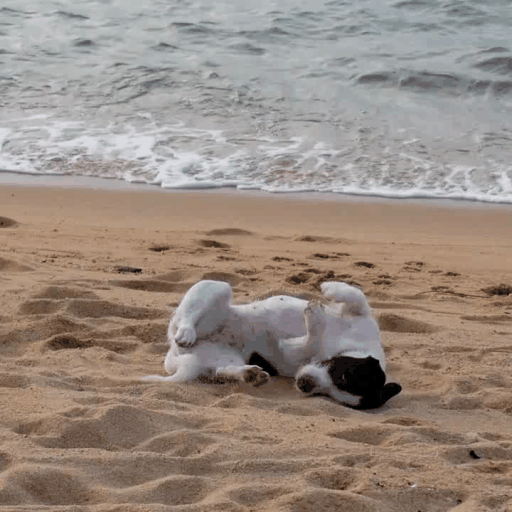
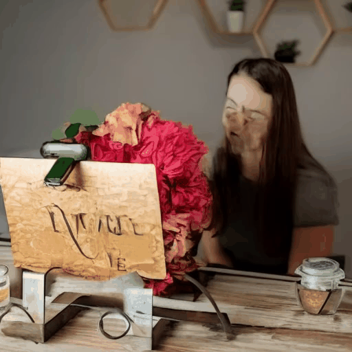

# VEGGIE: Instructional Editing and Reasoning Video Concepts with Grounded Generation

Official implementation of **VEGGIE**, a unified versatile video generative model that handles various tasks for both video concept grounding and editing according to user instructions. 

[Shoubin Yu*](https://yui010206.github.io/), [Difan Liu*](https://difanliu.github.io/), [Ziqiao Ma*](https://mars-tin.github.io/), 
[Yicong Hong](https://yiconghong.me/), [Yang Zhou](https://yzhou359.github.io), [Hao Tan](https://research.adobe.com/person/hao-tan/), [Joyce Chai](https://web.eecs.umich.edu/~chaijy/), [Mohit Bansal](https://www.cs.unc.edu/~mbansal/)

Adobe Research, University of Michigan, University of North Carolina at Chapel Hill

[](https://veggie-gen.github.io/)  [](https://arxiv.org/abs/2503.14350)   [](https://huggingface.co/datasets/Shoubin/VEGGIE-Bench)

<br>

<br>

<br>

<br>


# Instructional Video Editing Examples


*: Non-Instructional methods utilize paired video captions for editing.

### Instruction: Make it on the beach.

| Input Video | VEGGIE | VidToMe* | TokenFlow* | Flatten* | InstructDiff | LGVI | InsV2V |
|-------------|--------|---------|------------|----------|--------------|------|--------|
|  |  |  |  |  |  |  |  |

### Instruction: Please add a ball in the given video frames.

| Input Video | VEGGIE | VidToMe* | TokenFlow* | Flatten* | InstructDiff | LGVI | InsV2V |
|-------------|--------|---------|------------|----------|--------------|------|--------|
|  |  |  |  |  |  |  |  |

### Instruction: Make it Chinese ink style.

| Input Video | VEGGIE | VidToMe* | TokenFlow* | Flatten* | InstructDiff | LGVI | InsV2V |
|-------------|--------|---------|------------|----------|--------------|------|--------|
|  |  |  |  |  |  |  |  |

### Instruction: Could you label the bear in these video frames with red color masks?

| Input Video | VEGGIE | VidToMe* | TokenFlow* | Flatten* | InstructDiff | LGVI | InsV2V |
|-------------|--------|---------|------------|----------|--------------|------|--------|
|  |  |  |  |  |  |  |  |

### Instruction: Replace the cup with a bottle of flower.

| Input Video | VEGGIE | VidToMe* | TokenFlow* | Flatten* | InstructDiff | LGVI | InsV2V |
|-------------|--------|---------|------------|----------|--------------|------|--------|
|  |  |  |  |  |  |  |  |

### Instruction: Please remove the man in black in given video frames.

| Input Video | VEGGIE | VidToMe* | TokenFlow* | Flatten* | InstructDiff | LGVI | InsV2V |
|-------------|--------|---------|------------|----------|--------------|------|--------|
|  |  |  |  |  |  |  |  |

### Instruction: Make the swan white.

| Input Video | VEGGIE | VidToMe* | TokenFlow* | Flatten* | InstructDiff | LGVI | InsV2V |
|-------------|--------|---------|------------|----------|--------------|------|--------|
|  |  |  |  |  |  |  |  |

### Instruction: What can be used for heating food? Highlight your answer with red masks.

| Input Video | VEGGIE | VidToMe* | TokenFlow* | Flatten* | InstructDiff | LGVI | InsV2V |
|-------------|--------|---------|------------|----------|--------------|------|--------|
|  |  |  |  |  |  |  |  |


# Instructional Video Editing Examples


# Reference
Please cite our paper if you use our models in your works:

```bibtex
@article{yu2025veggie,
        title={VEGGIE: Instructional Editing and Reasoning Video Concepts with Grounded Generation}, 
        author={Shoubin Yu and Difan Liu and Ziqiao Ma and Yicong Hong and Yang Zhou and Hao Tan and Joyce Chai and Mohit Bansal},
        year={2025},
        journal={arXiv:2503.14350},
}
